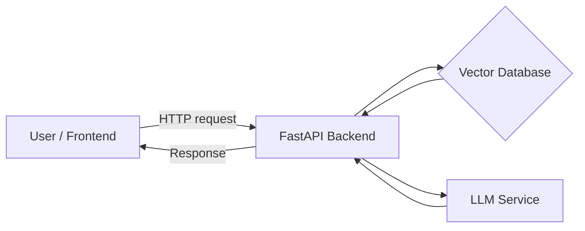

# Project 1: AI Knowledge Assistant – Specification

## Overview  
Build a question-answering assistant that uses company knowledge to answer user queries. The system will ingest documents (e.g. manuals, guidelines) and allow natural-language queries over that content via a chat interface or API.

## Objectives  
- Provide accurate, up-to-date answers by combining LLM generation with a dynamic knowledge base (Retrieval-Augmented Generation).  
- Deploy as a web service with API endpoints and (optionally) a web UI.

## Key Features  
- **Document Ingestion:** Import and preprocess text/PDF documents.  
- **Retrieval Engine:** Compute embeddings for chunks and query with cosine similarity.  
- **LLM Backend:** Use an LLM (GPT-4/GPT-3.5) to generate answers based on retrieved context.  
- **API:** A FastAPI service exposing `/ask` (question → answer) and `/docs` (Swagger UI).  
- **Chat Interface (optional):** A simple frontend (Streamlit/React) for user interaction.

## Architecture Diagram  

*Figure: High-level architecture. The FastAPI app handles requests, queries the vector DB for relevant context, then calls the LLM for generation.*

## Folder Structure  
```
project1/
├── app.py            # FastAPI app
├── ingestion.py     # Document loader and chunking
├── embeddings.py    # Embedding & vector index logic
├── qa.py            # Retrieval and LLM query functions
├── requirements.txt
├── Dockerfile
└── README.md
```

## Tech Stack and Justification  
- **Language:** Python 3 – rich ML ecosystem and our familiarity.  
- **Framework:** FastAPI – high-performance async API framework.  
- **LLM:** OpenAI GPT (via API) or an open model (LLaMA 2) for generation. Chosen for accuracy and maintenance.  
- **Embeddings:** OpenAI Embeddings or SentenceTransformers – to convert text to vectors.  
- **Vector DB:** Pinecone (managed vector DB) or Chroma (open source) – to store/query embeddings. Vector DBs handle large-scale similarity search efficiently.  
- **Database:** SQLite or PostgreSQL for metadata if needed. SQLite is lightweight and serverless (good for prototype).  
- **UI:** Streamlit (Python) or simple HTML/JS if adding a front-end. Streamlit allows quick UI prototyping.  
- **Deployment:** Docker container on AWS (Elastic Beanstalk/ECS) or Heroku. AWS chosen by default; we’ll provide guidance for alternatives (GCP, Azure).

## CI/CD Checklist  
- [ ] Automated tests for API endpoints and core functions.  
- [ ] Linting/formatting (e.g. flake8, black).  
- [ ] GitHub Actions (or equivalent) to run tests on push.  
- [ ] Docker build in pipeline.  
- [ ] Deployment trigger on successful build (e.g. push Docker image).  

## Deployment Steps  
1. **Dockerize:** Ensure `Dockerfile` builds the app image.  
2. **AWS Setup:** (Default) Push image to ECR; create ECS service or Elastic Beanstalk app. Alternatively, push to Heroku or Docker Cloud.  
3. **Configuration:** Provide environment variables (API keys, DB connections).  
4. **Run:** Start service, confirm `/docs` and `/ask` endpoints work.

## Monitoring & Logging  
- Configure logging (use Python’s `logging` module).  
- Expose basic metrics (request count, latency).  
- (Optional) Integrate Prometheus/Grafana or CloudWatch for logs/metrics.  

## Testing Plan  
- **Unit tests:** For ingestion, embedding, retrieval logic (e.g. pytest).  
- **Integration tests:** Spin up FastAPI (TestClient) and send sample queries, assert correct format of response.  
- **Load tests:** Simulate multiple queries to assess performance under concurrency (e.g. with `locust` or `ab`).  

## Sample Interview Questions  
- *Explain how Retrieval-Augmented Generation (RAG) works.* (Answer: it combines an LLM with external knowledge sources; RAG retrieves relevant documents by embeddings then conditions the LLM on those documents.)  
- *Why use a vector database?* (Answer: optimized for high-dimensional similarity search, scalability, and real-time indexing.)  
- *How do you ensure the system returns up-to-date info?* (Answer: the knowledge index can be updated by re-ingesting docs, avoiding re-training the model.)  
- *What are trade-offs of using GPT-4 vs an open LLM?* (Answer: GPT-4 offers high accuracy but cost/latency; open LLMs (like Llama2) are free but may need more prompt engineering.)
